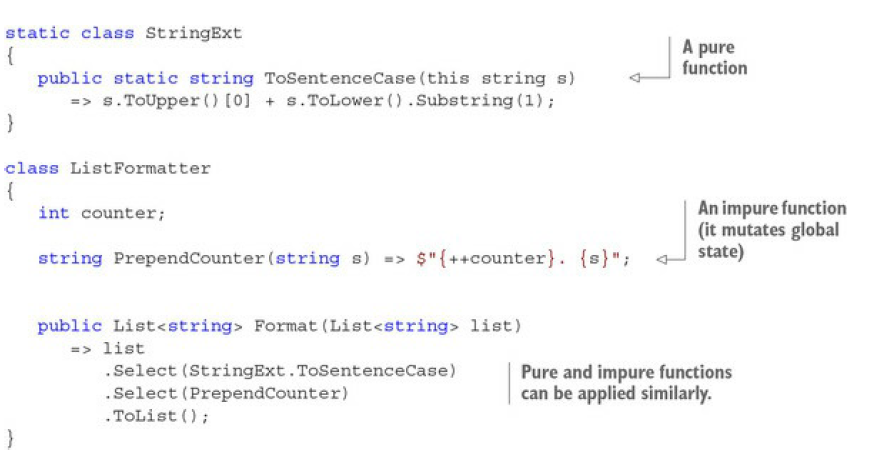

# Chapter 2. Why function purity matters

## 2.1. What is function purity?

We want function to do something - meaning to have side effect.
So let see the different between pure & impure function

| Pure functions                                      |                     Impure functions                      |
| --------------------------------------------------- | :-------------------------------------------------------: |
| The output depends entirely on the input arguments. | Factors other than input arguments may affect the output. |
| Cause no side effects.                              |                  May cause side effects.                  |

### 2.1.1. Purity and side effects

#### Impure functions

A function is said to have
side effects if it does any of the following:

* Mutates global state—“Global” here means any state that’s visible outside of the
  function’s scope. For example, a private instance field is considered global because it’s
  visible from all methods within the class.
* Mutates its input arguments
* Throws exceptions
* Performs any I/O operation— This includes any interaction between the program and the
  external world, including reading from or writing to the console, the filesystem, or a
  database, and interacting with any process outside the application’s boundary.

#### Pure functions

Pure functions have no side effects, and their output is solely determined by their
inputs.

### 2.1.2. Strategies for managing side effects

Ok, let’s aim to use pure functions whenever possible. But is it always possible? Is it ever
possible? Well, if you look at the list of things considered side effects, it’s a pretty mixed bag, so
the strategies for managing side effects depend on the types of side effects in question.

#### Isolate I/O effects

First with IO, which is always considered a side effect. First, here are a few examples that
will clarify why functions that perform I/O can never be pure:

* A function that takes a URL and returns the resource at that URL will yield a different
  result any time the remote resource changes, or it may throw an error if the connection is
  unavailable.
* A function that takes a file path and contents to be written to a file may throw an error if
  the directory doesn’t exist, or if the process hosting the program lacks write permissions.
* A function that returns the current time from the system clock will return a different result
  at any instant.

  As you can see, any dependency on the external world gets in the way of function purity because
  the state of the world affects the function’s return value. On the other hand, if your program is to
  do anything of use, there’s no escaping the fact that some I/O is required. Even a purely
  mathematical program that just performs a computation must perform some I/O to communicate
  its result. So some of your code will have to be impure.

Consider the following code:

```cs
WriteLine("Enter your name:");
var name = ReadLine();
WriteLine($"Hello {name}");
```

This trivial program (assume it’s wrapped in a Main method) mixes I/O with logic that could be
extracted in a pure function:

```cs
static string GreetingFor(string name) => $"Hello {name}";
```

#### Avoid mutating arguments

Another kind of side effect is the mutation of function arguments. Mutating function arguments
is a bad idea in any programming paradigm

Consider the following code:

```cs
decimal RecomputeTotal(Order order, List<OrderLine> linesToDelete)
{
    var result = 0m;
    foreach (var line in order.OrderLines)
    {
        if (line.Quantity == 0) linesToDelete.Add(line);
        else result += line.Product.Price * line.Quantity;
    }

    return result;
}
```

The behavior of the method is now tightly
coupled with that of the caller: the caller relies on the method to perform its side effect, and the
callee relies on the caller to initialize the list. As such, both methods must be aware of the
implementation details of the other, making it impossible to reason about the methods in
isolation.

This kind of side effect can easily be avoided by returning all the computed information to the
caller instead. For example, the preceding code can be refactored as follows:

```cs
(decimal, IEnumerable<OrderLine>) RecomputeTotal(Order order)
=> (order.OrderLines.Sum(l => l.Product.Price * l.Quantity)
, order.OrderLines.Where(l => l.Quantity == 0));
```

Following this principle, you can always structure your code in such a way that functions never
mutate their input arguments. In fact, it would be ideal to enforce this by always using immutable
objects—objects that, once created, cannot be changed.

## 2.2. What is function purity?

Imagine you want to format a list of strings as a numbered list; the casing
should be standardized, and each item should be preceded with a counter

```cs
var shoppingList = new List<string> { "coffee beans", "BANANAS", "Dates" };
new ListFormatter()
.Format(shoppingList)
.ForEach(WriteLine);
// prints: 1. Coffee beans
// 2. Bananas
// 3. Dates
```

Soulution



There are a few things to point out with respect to purity:

* `ToSentenceCase` is pure (its output is strictly determined by the input). Because its
  computation only depends on the input parameter, it can be made static without any
  problems.
* `PrependCounter` increments the counter, so it’s impure. Because it depends on an instance
  member—the counter—you can’t make it static.
* In the `Format` method, you apply both functions to items in the list with Select, irrespective
  of purity. In fact, there would ideally be a rule that
  Select should only be used with pure functions.

### 2.2.1. Pure functions parallelize well

Given a big enough set of data to process, it’s usually advantageous to process it in parallel,
especially when the processing is CPU-intensive and the pieces of data can be processed
independently.

Compare these two expressions:

```cs
list.Select(ToSentenceCase).ToList()
list.AsParallel().Select(ToSentenceCase).ToList()
```

The first expression uses the `Select` method defined on Enumerable to apply the pure function
`ToSentenceCase` to each element in the list. The second expression is very similar, but it uses
methods provided by Parallel LINQ (PLINQ). `AsParallel` turns the list into a ParallelQuery. As
a result, `Select` resolves to the implementation defined on ParallelEnumerable, which will apply
`ToSentenceCase` to each item in the list, but now in parallel. The list will be split into chunks, and
several threads will be fired off to process each chunk. In both cases, `ToList` harvests the results
into a list.

Concurrency is the general concept of having several things going on at the same time. More
formally, concurrency is when a program initiates a task before another one has completed, so
that different tasks are executed in overlapping time windows.
There are several scenarios in which concurrency can occur:

* **Asynchrony**— This means that your program performs non-blocking operations. For
  example, it can initiate a request for a remote resource via HTTP and then go on to do
  some other task while it waits for the response to be received. It’s a bit like when you send
  an email and then go on with your life without waiting for a response.
* **Parallelism**— This means that your program leverages the hardware of multi-core
  machines to execute tasks at the same time by breaking up work into tasks, each of which
  is executed on a separate core. It’s a bit like singing in the shower: you’re actually doing
  two things at exactly the same time.
* **Multithreading**— This is a software implementation allowing different threads to be
  executed concurrently. A multithreaded program appears to be doing several things at the
  same time even when it’s running on a single-core machine. This is a bit like chatting with
  different people through various IM windows; although you’re actually switching back
  and forth, the net result is that you’re having multiple conversations at the same time.

### 2.2.2. Parallelizing impure functions

### 2.2.3. Avoiding state mutation

One possible way to avoid the pitfalls of concurrent updates is to remove the problem at the
source: **don’t use shared state to begin with**.

The operation of pairing two parallel lists is a common operation in FP, and it’s called Zip.
Here’s an example.

```cs
Enumerable.Zip(
new[] {1, 2, 3},
new[] {"ichi", "ni", "san"},
(number, name) => $"In Japanese, {number} is: {name}")
// => ["In Japanese, 1 is: ichi",
// "In Japanese, 2 is: ni",
// "In Japanese, 3 is: san"]
```

#### The case for static methods

When all variables required within a method are provided as input (or are statically available),
the method can be made static. This chapter contains several examples of refactoring instance
methods to static methods.

Static methods can cause problems if they do either of the following:

* **Act on mutable static fields**— These are effectively the most global variables, and it’s well
  known that maintainability suffers from the presence of global mutable variables.
* **Perform I/O**— In this case, it’s testability that’s jeopardized. If method A depends on the
  I/O behavior of static method B, it’s not possible to unit test A.
  Note that both these cases imply an impure function. On the other hand, when a function is pure,
  there’s no downside to making it static. As a general guideline:
* Make pure functions static.
* Avoid mutable static fields.
* Avoid direct calls to static methods that perform I/O.
